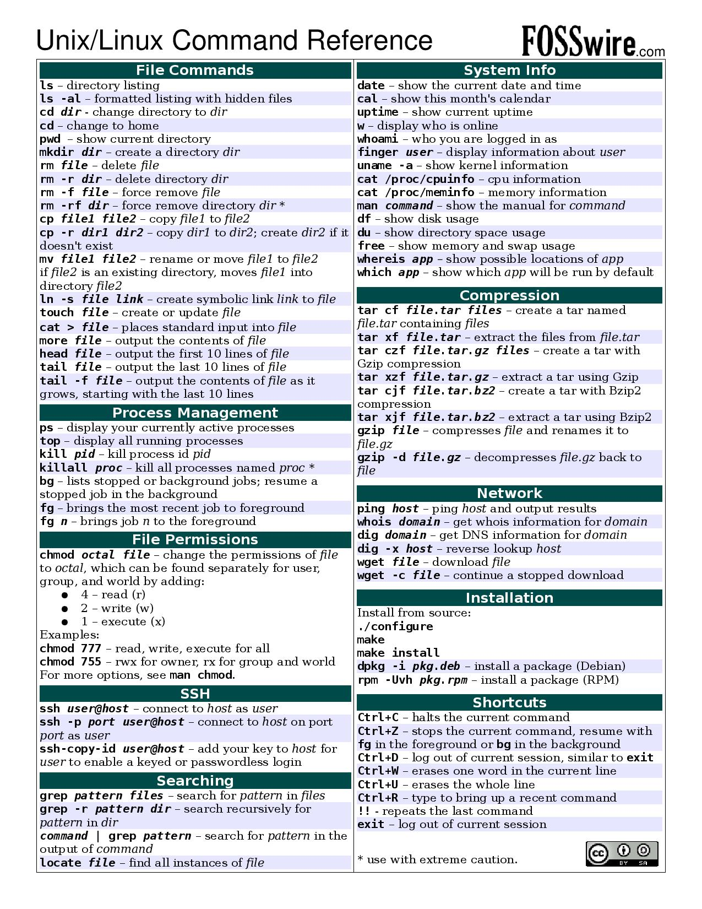

# **Command Line**

## **Command Line Sites**

* Explain commands before you use them: [ExplainShell](https://explainshell.com/)

* [Powershell in Y minutes](https://learnxinyminutes.com/docs/powershell/)

* [Bash in Y minutes](https://learnxinyminutes.com/docs/bash/)

* Tutorial to Master Commandline, [learnEnough: CommandLine](https://www.learnenough.com/command-line-tutorial/basics)

## **Command Line Books**

* [Conquering the command line](http://conqueringthecommandline.com/book/basics#code-basics-cp-r)

* [Bash for Professionals](https://books.goalkicker.com/BashBook/)

* [Powershell for professionals](https://books.goalkicker.com/PowerShellBook/)

* Command Line Cheat Sheet:

---

## **Questions and Answers**

* [Cluster of free information from /r/learnprogramming](https://www.reddit.com/r/learnprogramming/comments/fgi8i7/after_a_year_and_a_half_of_programming_i_just/)
