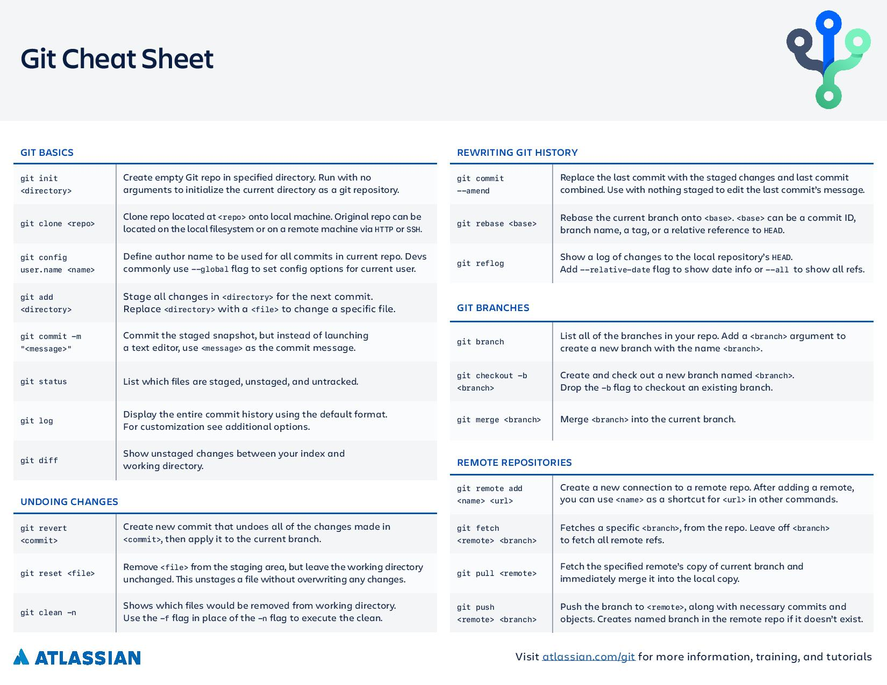
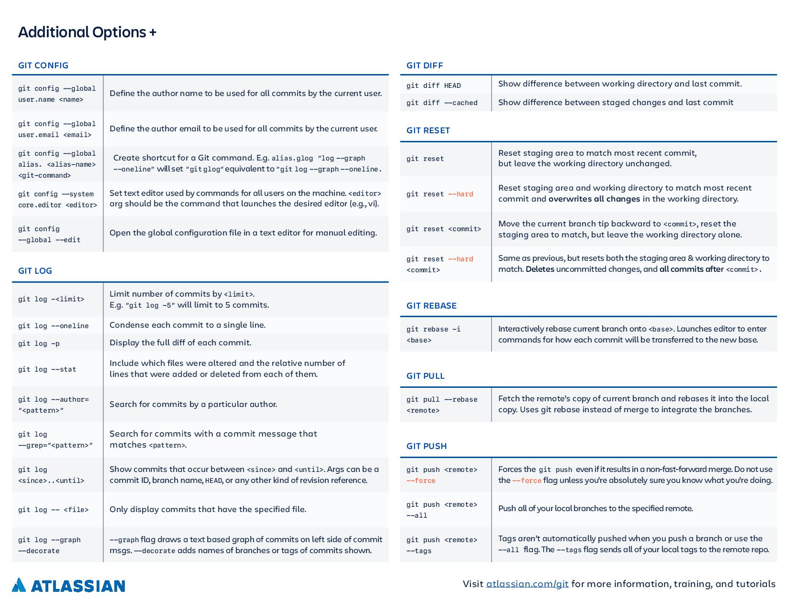

# **Git Resources**

Git Contents

1. [Sites](#sites)
2. [Books](#books)
3. [Questions and Answers](#qNa)

## **Sites** 

* [Git Documentation](https://git-scm.com/doc)

* [Git Cheatsheet](https://www.atlassian.com/git/tutorials/atlassian-git-cheatsheet)

## **Books** 

* [Git Notes for Professionals](https://books.goalkicker.com/GitBook/)

---

## **Questions and Answers** 

* How to add my GitHub account to my local git settings? :
 <https://kbroman.org/github_tutorial/pages/first_time.html>

* How to generate an SSH Key for Auth? :
 <https://help.github.com/en/github/authenticating-to-github/generating-a-new-ssh-key-and-adding-it-to-the-ssh-agent>

* How to generate an SSH Key in Windows10? : <https://www.howtogeek.com/336775/how-to-enable-and-use-windows-10s-built-in-ssh-commands/>

* How to add an SSH key to Github Account? : <https://help.github.com/en/github/authenticating-to-github/adding-a-new-ssh-key-to-your-github-account>
