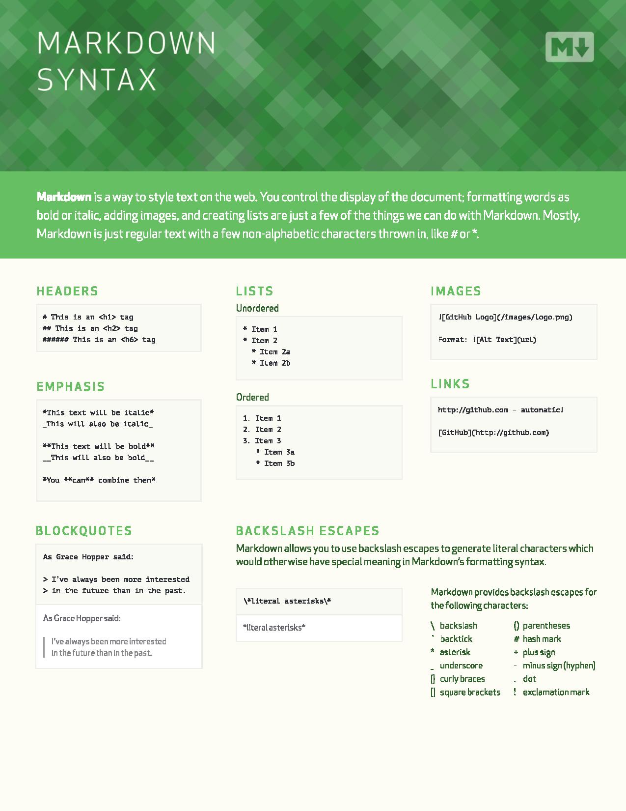
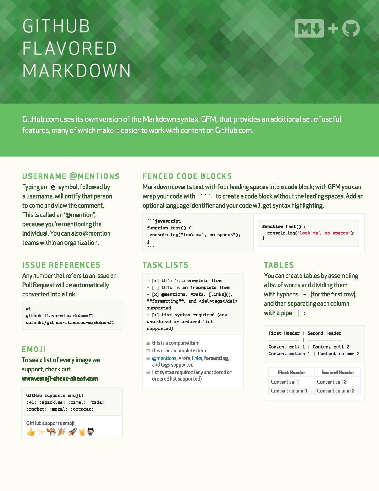

# **Markdown**

Markdown Contents

1. [Sites](#sites)
2. [Books](#books)
3. [Questions and Answers](#qNa)

## **Sites** 

* [Github Markdown Cheat Sheet](https://github.com/adam-p/markdown-here/wiki/Markdown-Cheatsheet)

* [Markdown Guide Resource](https://www.markdownguide.org/)

## **Books** 

* Github Markdown CheetSheets:

---

## **Questions and Answers** 
