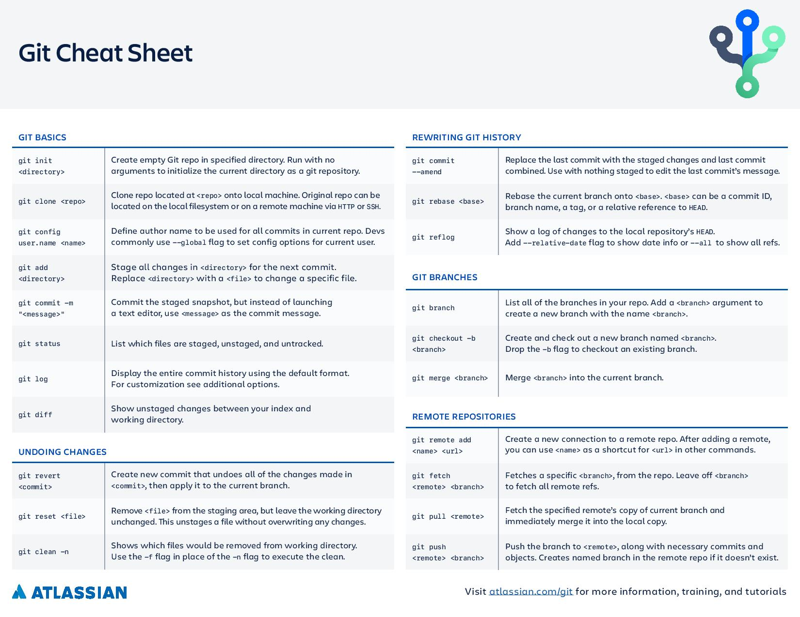

# Resources on a variety of things

## Table of Contents:

1.[Open Source Learning](#OSL)

2.[Command Line](#cL)

3.[asdas]

4.[asdsad]

---

### Open Source CS Learning Sites 

* Open Source University <https://github.com/ossu>

* Coding Interview University <https://github.com/jwasham/coding-interview-university>

* Exercism Mentorship <https://exercism.io/>

* StackOverflow Tutorial System <https://riptutorial.com/>

---

### Command Line 

---

### Markdown

* https://github.com/adam-p/markdown-here/wiki/Markdown-Cheatsheet

* <https://www.markdownguide.org/>

---

## Git

* Git Documentation: <https://git-scm.com/doc>

* Git Cheatsheet: <https://www.atlassian.com/git/tutorials/atlassian-git-cheatsheet>

---
